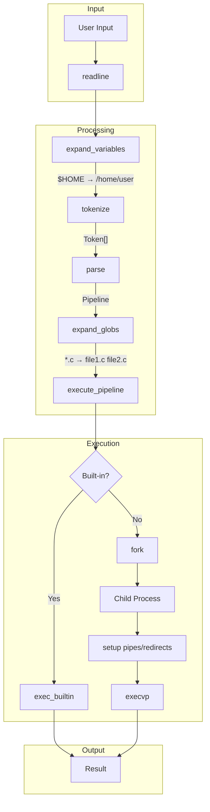
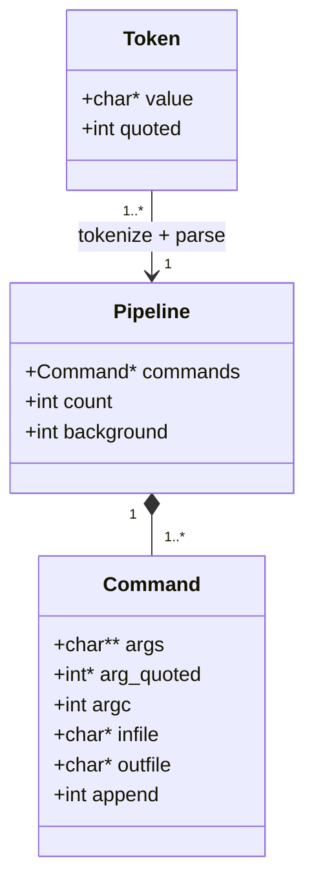
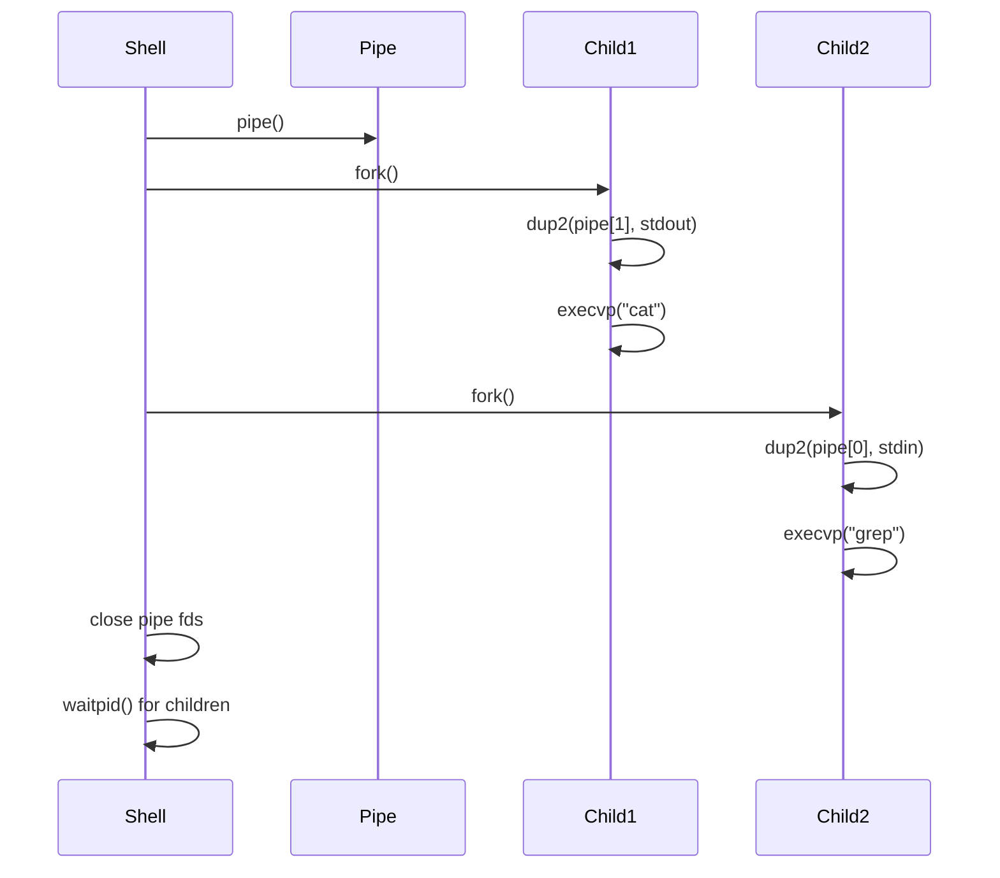

# vshell - A Mini Shell in C

A lightweight Unix shell implementation for learning systems programming concepts like process management, pipes, I/O redirection, and signal handling.

## What It Does

vshell is a fully functional command-line shell that can:

- Execute external programs (`ls`, `cat`, `grep`, etc.)
- Chain commands with pipes (`cmd1 | cmd2 | cmd3`)
- Redirect input/output to files (`>`, `>>`, `<`)
- Run processes in the background (`&`)
- Expand environment variables (`$HOME`, `${USER}`)
- Expand wildcards/globs (`*.c`, `file?.txt`)
- Maintain command history (up/down arrows)
- Handle signals gracefully (Ctrl+C won't kill the shell)

## Architecture



## Data Structures



## How It Works

### 1. Input Processing

```
User types: echo $HOME/*.c | wc -l > count.txt &
                 │           │        │        │
                 ▼           ▼        ▼        ▼
            var expand   glob    redirect  background
```

### 2. Tokenization

The input string is split into tokens, respecting quotes:

```
Input:  echo "hello world" $HOME

Tokens: ["echo", "hello world", "/home/user"]
         word    quoted string   expanded var
```

### 3. Parsing

Tokens become a Pipeline of Commands:

```
Input: cat file.txt | grep error | head -5

Pipeline:
├── Command[0]: args=["cat", "file.txt"]
├── Command[1]: args=["grep", "error"]
└── Command[2]: args=["head", "-5"]
```

### 4. Execution



## Building

### Prerequisites

```bash
# Ubuntu/Debian
sudo apt-get install gcc make libreadline-dev

# Fedora/RHEL
sudo dnf install gcc make readline-devel

# macOS
xcode-select --install  # readline is included
```

### Compile

```bash
cd vshell
make
```

### Output

```
gcc -Wall -Wextra -Wno-unused-parameter -g -c -o main.o main.c
gcc -Wall -Wextra -Wno-unused-parameter -g -c -o parser.o parser.c
gcc -Wall -Wextra -Wno-unused-parameter -g -c -o executor.o executor.c
gcc -Wall -Wextra -Wno-unused-parameter -g -c -o builtins.o builtins.c
gcc -Wall -Wextra -Wno-unused-parameter -g -c -o expand.o expand.c
gcc -Wall -Wextra -Wno-unused-parameter -g -o vshell main.o parser.o executor.o builtins.o expand.o -lreadline
```

This produces a single executable: `vshell`

## Usage Examples

### Basic Commands

```bash
$ ./vshell
vshell - a mini shell (type 'help' for commands)
user:~/vshell$ ls -la
total 120
drwxr-xr-x 2 user user  4096 Mar 18 10:00 .
-rw-r--r-- 1 user user  3521 Mar 18 10:00 main.c
-rw-r--r-- 1 user user  2847 Mar 18 10:00 parser.c
...

user:~/vshell$ pwd
/home/user/vshell
```

### Pipes

```bash
user:~$ cat /etc/passwd | grep root | cut -d: -f1
root

user:~$ ls -la | grep "\.c$" | wc -l
5
```

### I/O Redirection

```bash
# Output redirection (creates/truncates file)
user:~$ echo "Hello, World!" > greeting.txt

# Append redirection
user:~$ echo "How are you?" >> greeting.txt

# Input redirection
user:~$ wc -l < greeting.txt
2

# Combined
user:~$ sort < unsorted.txt > sorted.txt
```

### Environment Variables

```bash
user:~$ echo $HOME
/home/user

user:~$ echo "User: $USER, Shell: $SHELL"
User: user, Shell: /bin/bash

user:~$ echo ${HOME}/projects
/home/user/projects

# Special variables
user:~$ echo $$
12345

user:~$ ls nonexistent 2>/dev/null; echo $?
2
```

### Glob Expansion

```bash
user:~/vshell$ ls *.c
builtins.c  executor.c  expand.c  main.c  parser.c

user:~/vshell$ ls *.h
builtins.h  executor.h  expand.h  parser.h  vshell.h

user:~$ echo /etc/*.conf | tr ' ' '\n' | head -3
/etc/adduser.conf
/etc/ca-certificates.conf
/etc/debconf.conf
```

### Background Execution

```bash
user:~$ sleep 10 &
[bg] 12346

user:~$ echo "I can type while sleep runs"
I can type while sleep runs

# Later...
[done] 12346 (exit 0)
```

### Built-in Commands

```bash
user:~$ help
vshell - a mini shell

Built-in commands:
  cd [dir]          Change directory (default: $HOME)
  exit [code]       Exit the shell
  pwd               Print working directory
  export VAR=val    Set environment variable
  unset VAR         Unset environment variable
  env               Print all environment variables
  help              Show this help message
...

user:~$ cd /tmp
user:/tmp$ pwd
/tmp

user:/tmp$ export MY_VAR=hello
user:/tmp$ echo $MY_VAR
hello

user:/tmp$ unset MY_VAR
user:/tmp$ echo $MY_VAR

user:/tmp$ exit 0
```

### Quoting

```bash
# Double quotes: variables expand, spaces preserved
user:~$ echo "Home is $HOME"
Home is /home/user

# Single quotes: literal, no expansion
user:~$ echo 'Home is $HOME'
Home is $HOME

# Escape characters
user:~$ echo "She said \"hello\""
She said "hello"
```

### Command History

Use **Up/Down arrows** to navigate through previous commands. History is saved to `~/.vshell_history` on exit.

## Project Structure

```
vshell/
├── Makefile        # Build configuration
├── vshell.h        # Common definitions (Token, Command, Pipeline)
├── main.c          # Entry point, REPL loop, signal handling
├── parser.c/.h     # Lexer (tokenizer) + Parser
├── expand.c/.h     # Variable expansion ($VAR) + Glob expansion (*.c)
├── builtins.c/.h   # Built-in commands (cd, exit, pwd, export, etc.)
└── executor.c/.h   # Process execution, pipes, redirections
```

## System Calls Used

| System Call | Purpose | Used In |
|------------|---------|---------|
| `fork()` | Create child process | executor.c |
| `execvp()` | Execute program | executor.c |
| `pipe()` | Create pipe for IPC | executor.c |
| `dup2()` | Redirect file descriptors | executor.c |
| `waitpid()` | Wait for child process | executor.c |
| `open()` | Open file for redirection | executor.c |
| `chdir()` | Change directory | builtins.c |
| `getcwd()` | Get current directory | builtins.c, main.c |
| `getenv()` | Get environment variable | expand.c, builtins.c |
| `setenv()` | Set environment variable | builtins.c |
| `sigaction()` | Set up signal handlers | main.c |
| `glob()` | Expand wildcards | expand.c |

## Learning Path

Recommended order for reading the source code:

1. **vshell.h** - Understand the data structures
2. **main.c** - See the main loop and signal handling
3. **parser.c** - Learn tokenization and parsing
4. **expand.c** - See variable and glob expansion
5. **builtins.c** - Simple built-in command implementations
6. **executor.c** - The core: fork, exec, pipes, redirections

## Limitations

- No job control (`fg`, `bg`, `jobs`)
- No command substitution (`$(cmd)` or `` `cmd` ``)
- No arithmetic expansion (`$((1+2))`)
- No here-documents (`<<EOF`)
- No `~user` expansion (only `~` for current user)
- No aliases or functions

## License

Educational use. Feel free to modify and learn from it.
